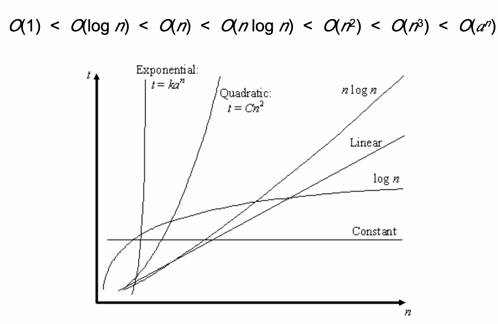

Textos extraídos e/ou adaptados a partir das referências bibliográficas (1) e (2).
Leitura recomendada: Introdução à análise de algoritmos [Material do Prof. João Brunet - UFCG](https://joaoarthurbm.github.io/eda/posts/introducao-a-analise/)

# Análise de algoritmos

Para a maioria dos problemas, há diferentes algoritmos que podem ser usados para sua resolução. Como analisar, comparar e escolher o _melhor algoritmo_ para a solução de um problema em um determinado contexto? 

Neste curso, consideramos que 
os problemas possuem um _tamanho N_ (em geral, associado ao montante de dados a serem processados) e que
os recursos utilizados por cada programa (tempo, memória, etc) serão descritos como uma função de _N_. 
Em geral, pode-se considerar o _caso médio_ (o tempo de execução com dados de entrada _típicos_) 
e o _pior caso_ (o tempo consumido na pior configuração possível dos dados de entrada). 

## Modelo 

Um modelo abstrato (que ignora aspectos relativos a sistemas de computação ou hardware) será usado para medir o custo de utilização de um algoritmo.
Por exemplo, para algoritmos de ordenação (Bubble Sort, Quick Sort, etc), pode-se considerar o número de comparações entre elementos do conjunto a ser ordenado e ignorar outras operações.

Para medir o custo de execução de um algoritmo é comum definir uma 
_função de custo_ ou _função de complexidade_ _f_, 
onde _f(n)_ é a medida da _quantidade de tempo_ necessário para executar um algoritmo para um problema de tamanho _N_
(conceitualmente, mas com menor frequência, também se pode medir o custo com base na _quantidade de memória_ necessária).
A medida de custo de execução de um algoritmo depende principalmente do tamanho da entrada de dados. 
Por isso, é comum considerar-se o tempo de execução de um programa como uma função do tamanho da entrada, _f(n)_. 

    function Max (var A: Vetor): integer;
    var i, Temp: integer;
    begin 
      Temp := A[1];
      for i:= 2 to n do 
        if Temp < A[i] then Temp := A[i];
      Max := Temp;
    end;
    
    int max(int A[]) {
        int temp = A[0];
        for (int i=1; i<10; i++) {
            if (A[i] > temp) 
                temp = A[i];
        }
        return temp;
    }
    
A função Max tem custo _n-1_ 
pois sempre irá realizar _n-1_ comparações para encontrar o maior valor em um vetor A de tamanho _n_, _n >=1_. 
Além disso, a função Max possui _custo uniforme_ sobre todos os problemas de tamanho _n_ 
pois seu custo independe da posição do maior elemento no vetor.

Entretanto, para alguns algoritmos, 
o custo de execução pode ser uma função de outras características da entrada de dados, 
e não apenas do tamanho da entrada. 
Assim, há três cenários a considerar: 
_melhor caso_ (menor tempo de execução sobre todas as possíveis entradas de tamanho _n_), 
_pior caso_ (maior tempo de execução sobre todas as entradas de tamanho _n_) e 
_caso médio_ (média dos tempos de execução de todas as entradas de tamanho _n_). 

Por exemplo, considere o problema de _busca sequencial_ em um arquivo de _n_ registros, 
com base em uma determinada chave.
O _melhor caso_ ocorre quando a chave é encontrada no primeiro registro do arquivo (_f(n) = 1_). 
Qual o _pior caso_? Qual o _caso médio_?

- Questão: Qual o custo de MaxMin? É possível melhorar?

        procedure MaxMin (var A: Vetor; var Max, Min: integer);
        var i: integer;
        begin 
            Max := A[1]; Min := A[1];
            for i:= 2 to n do 
            begin
              if A[i] > Max then Max := A[i];
              if A[i] < Min then Min := A[i];
            end;
        end;
        
Em geral, o interesse está em comparar algoritmos, ao invés de determinar o seu tempo exato de execução e, em particular, em funções que descrevem o comportamento dos algoritmos para grandes tamanhos de entrada: _análise assintótica_.
    
## Comportamento assintótico de funções

Leitura recomendada: Análise assintótica [Material do Prof. João Brunet - UFCG](https://joaoarthurbm.github.io/eda/posts/analise-assintotica/)

O parâmetro _N_ fornece uma medida da dificuldade para se resolver um problema, no sentido de que o tempo necessário para executar um programa que resolve o problema cresce quando _N_ cresce. Em geral, os algoritmos estudados aqui têm tempo de execução proporcional a uma das funções seguintes:

+ 1. A maioria das instruções são executadas uma vez ou poucas vezes. Se todas as instruções de um programa tiverem essa propriedade, diz-se que seu tempo de execução é _constante_.

+ logN. Quando o tempo de execução de um programa é _logaritmico_, o programa busca resolver um problema grande transformando-o em um problema mais simples, em geral, dividindo o tamanho da entrada por uma constante.

+ N. Quando o tempo de execução de um programa é _linear_, possivelmente algum tipo de processamento simples é feito sobre cada elemento da entrada.

+ N logN. Tal tempo de execução é observado em algoritmos que buscam resolver um problema grande dividindo-o em subproblemas menores, resolvendo cada um deles e combinando suas soluções.

+ N2. O tempo de execução de um programa é _quadrático_; por exemplo, laços aninhados que processam todos os pares de dois conjuntos.

+ 2N.  O tempo de execução de um programa é _exponencial_.

## A notação Θ (Theta)

Para duas funções f(n) e g(n), dizemos que f(n) é _Θ(g(n))_ se

0 <= c1∗g(n) <= f(n) <= c2∗g(n) ,∀n >= n0

## A notação _O_ (_big-Oh notation_) 

Classes de comportamento assintótico.

Enquanto a notação _Θ_define os limites inferior e superior de uma função, a notação _O_ (_big-Oh notation_) 
define apenas o limite superior para uma determinada função.

Para duas funções f(n) e g(n), dizemos que f(n) é _O(g(n))_ se

0 <=  f(n) <= c∗g(n) ,∀n >= n0

Se _f_ é uma função de complexidade para um algoritmo F, então _O(f)_ é considerada a complexidade assintótica ou o comportamento assíntótico do algoritmo F. 
Afirmar que f(n) ∈ _O(g(n))_ significa dizer que o crescimento de f(n) é menor ou igual ao crescimento de g(n).

_O(1)_, 
_O(logn)_, 
_O(n)_,
_O(n logn)_,
_O(n2)_,
_O(n3)_,
_O(2n)_

