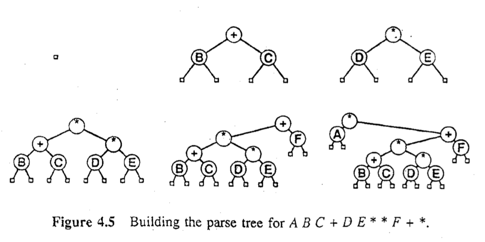

## Árvores

 
Uma _árvore_ é uma coleção não-vazia de _vértices_ (ou _nós_) e 
_arestas_ que satisfaz alguns requisitos. 
Um _nó_ é um objeto simples que pode ter um nome e outras informações associadas. 
Uma _aresta_ é uma conexão entre dois nós. 
Um _caminho_ em uma árvore é uma lista de nós distintos na qual nós sucessivos 
estão conectados por arestas na árvore. 
Um nó  da árvore é designado como _raiz_. 
Uma propriedade fundamental de uma árvore é que 
há exatamente um caminho entre a raiz e cada um dos outros nós na árvore.

Em geral, desenha-se a árvore com o nó raiz no topo, 
como mostra a figura a seguir (Exemplo 1), onde o  nó raiz é "E".
Diz-se que um nó y _está abaixo de_ um nó x (e x _está acima de_ y)
se x estiver em algum caminho que leva de y até a raiz. 
Por exemplo, na figura a seguir,  o nó "T" está abaixo de "R".


Todos os nós da árvore, exceto o nó raiz, possuem um _pai_ (_parent_).
Os nós diretamente abaixo de um dado nó são chamados de nós _filhos_ (_children").
Em analogia com árvore genealógica, podemos usar os termos 
_irmãos_ (_siblings_), _avô_, _neto_, etc.
No exemplo 1 acima, "P" é neto de "R" e possui 3 irmãos.

Um nó sem filhos é chamado de _folha_ (_leaf_) ou  _nó terminal_ ou ainda, _nó externo_.
Um nó com ao menos um filho é chamado de _não terminal_ ou _nó interno_.

Todo nó é raiz de uma _subárvore_ que inclui o próprio nó e os nós abaixo dele. 
No exemplo acima, há 7 subárvores de um nó apenas, 
uma subárvore de 3 nós, 
uma subárvore de 5 nós, e uma subárvore de 6 nós.

Uma _árvore ordenada_ é aquela em que a ordem dos filhos em cada nó é definida.

Os nós de uma árvore dividem-se em _níveis_: o nível de um nó é o número de nós
no caminho que leva desse nó ao nó raiz (sem incluir o próprio nó). No exemplo 1,
"R" é um nó de nível 1 e "T" é um nó nível 2.

A _altura_ de uma árvore é igual ao nível máximo entre todos os seus nós 
(ou a distância máxima até a raiz a partir de qualquer nó).
O comprimento do caminho (_path length_) de uma árvore é a soma de todos os níveis
de todos os nós da árvore.
No exemplo 1, a árvore possui altura igual a 3 e comprimento do caminho igual a 21.


Uma _árvore binária_ é definida com um conjunto finito de nós que, ou está vazio, 
ou consiste de um nó _raiz_ mais os elementos de duas árvores binárias distintas, 
chamadas de _subárvore esquerda_ e _subáarvore direita_ do nó raiz. 
Em uma árvore binária, cada nó tem no máximo duas subárvores.
Há dois tipos de nós: 
_nós externos_, sem filhos, e _nós internos_, com no máximo  dois filhos.


## Algumas Propriedades

+ (1) _Há exatamente um caminho que conecta quaisquer dois vértices de uma árvore_.

+ (2) Uma árvore com N nós possui N-1 arestas.

+ (3) Uma árvore binária com N nós internos possui N+1 nós externos.

+ (4) A altura de uma árvore binária completa (_full_) com N nós internos é ~logN na base 2.

Ou a operação de busca ou a operação de inserção pode ser eficiente na representação com listas, mas não ambas. Estruturas em árvore permitem o acesso e a atualização eficientes em grandes volumes de dados.


## Árvores Binárias de Pesquisa

```
struct node {
   int info;
   struct node *l;
   struct node *r;
};
```




## Percurso em Árvores Binárias

Como visitar sistematicamente cada nó de uma árvore?

Há diferentes métodos que consideram diferentes ordens para visitar os nós.

### pré-ordem (_preorder_)

Root, Left, Right.

### em ordem (_inorder_)

Left, Root, Right.

### pós-ordem (_posorder_)

Left, Right, Root.

### _level order_ 


