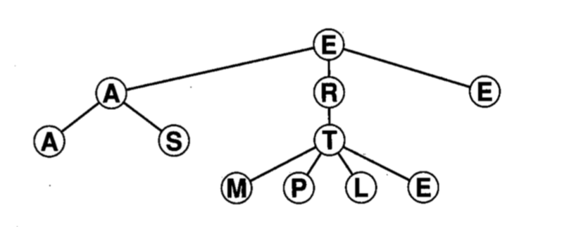
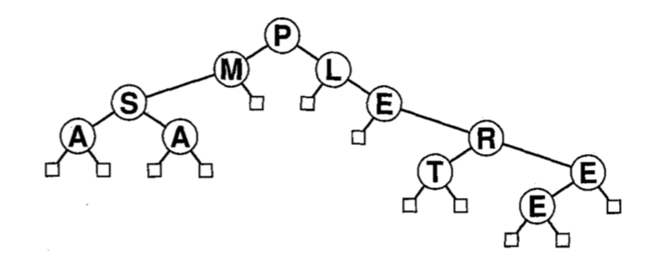

## Árvores

 
Uma _árvore_ é uma coleção não-vazia de _vértices_ (ou _nós_) e 
_arestas_ que satisfaz alguns requisitos. 
Um _nó_ é um objeto simples que pode ter um nome e outras informações associadas. 
Uma _aresta_ é uma conexão entre dois nós. 
Um _caminho_ em uma árvore é uma lista de nós distintos na qual nós sucessivos 
estão conectados por arestas na árvore. 
Um nó  da árvore é designado como _raiz_. 
Uma propriedade fundamental de uma árvore é que 
há exatamente um caminho entre a raiz e cada um dos outros nós na árvore.

Em geral, desenha-se a árvore com o nó raiz no topo, 
como mostra a figura a seguir (Exemplo 1), onde o  nó raiz é "E".
Diz-se que um nó y _está abaixo de_ um nó x (e x _está acima de_ y)
se x estiver em algum caminho que leva de y até a raiz. 
Por exemplo, na figura a seguir,  o nó "T" está abaixo de "R".

Todos os nós da árvore, exceto o nó raiz, possuem um _pai_ (_parent_).
Os nós diretamente abaixo de um dado nó são chamados de nós _filhos_ (_children").
Em analogia com árvore genealógica, podemos usar os termos 
_irmãos_ (_siblings_), _avô_, _neto_, etc.
No exemplo 1 acima, "P" é neto de "R" e possui 3 irmãos.

Um nó sem filhos é chamado de _folha_ (_leaf_) ou  _nó terminal_ ou ainda, _nó externo_.
Um nó com ao menos um filho é chamado de _não terminal_ ou _nó interno_.

Todo nó é raiz de uma _subárvore_ que inclui o próprio nó e os nós abaixo dele. 
No exemplo acima, há 7 subárvores de um nó apenas, 
uma subárvore de 3 nós, 
uma subárvore de 5 nós, e uma subárvore de 6 nós.

## Árvores Binárias 

Uma _árvore binária_ é definida com um conjunto finito de nós que, ou está vazio, ou consiste de um nó _raiz_ mais os elementos de duas árvores binárias distintas, chamadas de subárvores esquerda e direita do nó raiz. Em uma árvore binária, cada nó tem no máximo duas subárvores.
Há dois tipos de nós: _nós externos_, sem filhos, e _nós internos_, com no máximo  dois filhos.

## Algumas Propriedades

+ _Há exatamente um caminho que conecta quaisquer dois vértices de uma árvore_.

+ Uma árvore com N nós possui N-1 arestas.

Ou a operação de busca ou a operação de inserção pode ser eficiente na representação com listas, mas não ambas. Estruturas em árvore permitem o acesso e a atualização eficientes em grandes volumes de dados.

## Árvores Binárias de Pesquisa

## Percurso em Árvores Binárias

